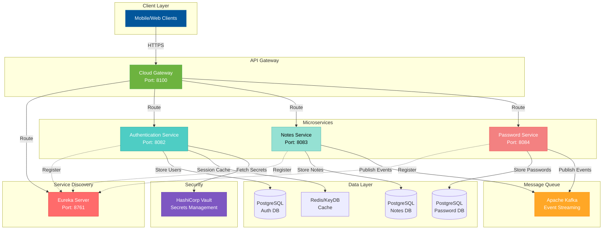
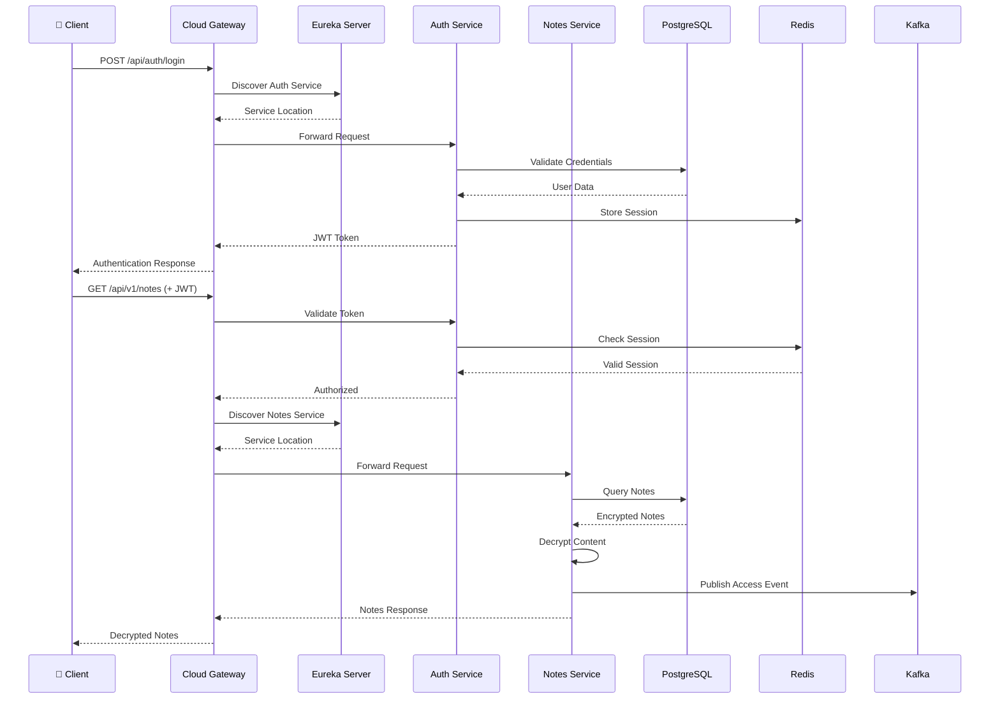

<div align="center">


# 🚀 THISJOWI Backend

### Modern Microservices Architecture with Spring Boot

[](https://openjdk.org/)
[](https://spring.io/projects/spring-boot)
[](https://spring.io/projects/spring-cloud)
[](https://kubernetes.io/)
[](https://www.docker.com/)
[](LICENCE.md)

[🎯 Features](#-features) •
[🏗️ Architecture](#️-architecture) •
[🚀 Quick Start](#-quick-start) •
[📚 API Docs](#-api-documentation) •
[🤝 Contributing](CONTRIBUTING.md)

</div>

---

## 📋 Table of Contents

- [Overview](#-overview)
- [Features](#-features)
- [Architecture](#️-architecture)
- [Tech Stack](#-tech-stack)
- [Services](#-services)
- [Project Structure](#-project-structure)
- [Prerequisites](#-prerequisites)
- [Installation](#-installation)
- [Running the Application](#-running-the-application)
- [Configuration](#-configuration)
- [API Documentation](#-api-documentation)
- [Deployment](#-deployment)
- [Development](#-development)
- [Testing](#-testing)
- [Security](#-security)
- [Contributing](#-contributing)
- [License](#-license)
- [Support](#-support)

---

## 🎯 Overview

**THISJOWI Backend** is a production-ready microservices architecture built with Spring Boot, designed for scalability, reliability, and security. It provides a complete backend solution with:

- 🔐 **Secure Authentication** - JWT-based authentication with OAuth2 integration
- 📝 **Notes Management** - Complete CRUD operations with AES-256 encryption
- 🔑 **Password Vault** - Secure password storage and management system
- 🌐 **API Gateway** - Centralized routing and load balancing with Spring Cloud Gateway
- 🔍 **Service Discovery** - Automatic service registration with Netflix Eureka
- 📊 **Event-Driven** - Kafka integration for asynchronous communication
- 🐳 **Container Ready** - Docker and Kubernetes deployment configurations
- 🔒 **Secrets Management** - HashiCorp Vault integration for secure credential storage

---

## ✨ Features

<details>
<summary><b>🔐 Authentication & Security</b></summary>

- JWT token generation and validation
- OAuth2 authentication (Google, GitHub)
- Spring Security integration
- Redis-based session caching
- HashiCorp Vault for secrets management
- Password encryption with BCrypt
- Token refresh mechanism
- Role-based access control (RBAC)

</details>

<details>
<summary><b>� Notes Management</b></summary>

- Create, read, update, delete notes
- AES-256-CBC encryption for content
- User-specific note isolation
- Tag-based organization
- Full-text search capabilities
- Kafka event publishing for note changes
- RESTful API design
- Swagger/OpenAPI documentation

</details>

<details>
<summary><b>🔑 Password Management</b></summary>

- Secure password storage with encryption
- Password generation utilities
- Password sharing capabilities
- Category-based organization
- Kafka integration for audit logging
- Auto-expiration for shared passwords
- Password strength validation
- Encrypted at rest and in transit

</details>

<details>
<summary><b>🏗️ Microservices Architecture</b></summary>

- Service discovery with Eureka
- API Gateway for routing
- Load balancing
- Circuit breakers (Resilience4j)
- Distributed tracing
- Centralized logging
- Health monitoring
- Metrics and monitoring ready

</details>

<details>
<summary><b>☁️ Cloud Native & DevOps</b></summary>

- Docker containerization
- Kubernetes manifests
- Horizontal scaling support
- Rolling updates
- Health checks and probes
- ConfigMaps and Secrets
- Ingress configuration
- CI/CD ready

</details>

---

## 🏗 Architecture



### 🔄 Request Flow



---

## 🛠️ Tech Stack

### Core Technologies
| Technology | Version | Purpose |
|-----------|---------|---------|
|  | 21 | Programming language |
|  | 3.2.5 | Backend framework |
|  | 2023.0.0 | Microservices toolkit |
|  | 3.8+ | Build & dependency management |

### Microservices Components
| Technology | Purpose |
|-----------|---------|
|  | Authentication & Authorization |
|  | Service Discovery |
|  | API Gateway & Routing |
|  | Circuit Breaker & Fault Tolerance |

### Data & Caching
| Technology | Purpose |
|-----------|---------|
|  | Primary database |
|  | Session caching & performance |
|  | ORM & data persistence |

### Messaging & Streaming
| Technology | Purpose |
|-----------|---------|
|  | Event streaming & messaging |

### Security & Secrets
| Technology | Purpose |
|-----------|---------|
|  | Secrets management |
|  | Token-based authentication |

### DevOps & Deployment
| Technology | Purpose |
|-----------|---------|
|  | Containerization |
|  | Container orchestration |
|  | CI/CD pipelines |

### Documentation & Monitoring
| Technology | Purpose |
|-----------|---------|
|  | API documentation |
|  | Health checks & metrics |

---

## 🎛 Services

### 1. **Authentication Service** (`/Authentication`)

<details>
<summary>View Details</summary>

**Description:** Handles user authentication, authorization, and session management.

**Key Features:**
- User registration and login
- JWT token generation and validation
- OAuth2 integration (Google, GitHub)
- Redis-based session caching
- Vault integration for secrets
- Password reset functionality
- Role-based access control

**Technology Stack:**
- Spring Boot 3.2.5
- Spring Security
- Spring Data JPA
- Redis/KeyDB
- PostgreSQL
- HashiCorp Vault

**Port:** `8082` | **Endpoint:** `/api/auth`

**Swagger UI:** `http://localhost:8082/swagger-ui.html`

</details>

### 2. **Notes Service** (`/Notes`)

<details>
<summary>View Details</summary>

**Description:** Provides comprehensive note management with encryption.

**Key Features:**
- Create, read, update, delete notes
- AES-256-CBC encryption for content
- User-specific note management
- Tag-based organization
- Kafka event publishing
- Full-text search
- Note sharing capabilities

**Technology Stack:**
- Spring Boot 3.2.5
- Spring Data JPA
- PostgreSQL
- Apache Kafka
- AES Encryption

**Port:** `8083` | **Endpoint:** `/api/v1/notes`

**Swagger UI:** `http://localhost:8083/swagger-ui.html`

</details>

### 3. **Password Service** (`/Password`)

<details>
<summary>View Details</summary>

**Description:** Secure password vault for storing and managing credentials.

**Key Features:**
- Secure password storage
- Password generation
- Encryption at rest
- Password sharing
- Category management
- Kafka integration for audit logs
- Auto-expiration for shared passwords

**Technology Stack:**
- Spring Boot 3.2.5
- Spring Data JPA
- PostgreSQL
- Apache Kafka
- Encryption utilities

**Port:** `8084` | **Endpoint:** `/api/v1/passwords`

**Documentation:** See [KAFKA_INTEGRATION.md](Password/KAFKA_INTEGRATION.md)

</details>

### 4. **Cloud Gateway** (`/Cloud`)

<details>
<summary>View Details</summary>

**Description:** API Gateway for routing and load balancing.

**Key Features:**
- Request routing to microservices
- Load balancing
- CORS configuration
- Rate limiting
- Request/response filtering
- Circuit breaker integration
- Service discovery integration

**Technology Stack:**
- Spring Cloud Gateway
- Spring Cloud Netflix
- Eureka Client

**Port:** `8100` | **Endpoint:** `/api/*`

</details>

### 5. **Eureka Discovery Server** (`/Eureka`)

<details>
<summary>View Details</summary>

**Description:** Service registry for automatic service discovery.

**Key Features:**
- Service registration
- Service discovery
- Health monitoring
- Load balancing support
- Failover capabilities
- Dashboard UI

**Technology Stack:**
- Spring Cloud Netflix Eureka
- Spring Boot

**Port:** `8761` | **Dashboard:** `http://localhost:8761`

</details>

---

## 📁 Project Structure

```
backend/
│
├── ⚙️ Authentication/              # 🔐 Authentication Service (Port 8082)
│   ├── src/
│   │   ├── main/
│   │   │   ├── java/uk/thisjowi/Authentication/
│   │   │   │   ├── config/          # Security & Redis configuration
│   │   │   │   ├── controller/      # REST endpoints
│   │   │   │   ├── dto/             # Data Transfer Objects
│   │   │   │   ├── entity/          # JPA entities
│   │   │   │   ├── filters/         # JWT & auth filters
│   │   │   │   ├── kafka/           # Kafka configuration
│   │   │   │   ├── model/           # Domain models
│   │   │   │   ├── repository/      # Data access layer
│   │   │   │   ├── service/         # Business logic
│   │   │   │   └── utils/           # Utility classes
│   │   │   └── resources/
│   │   │       └── application.yaml # Service configuration
│   │   └── test/                    # Unit & integration tests
│   ├── Dockerfile
│   ├── compose.yaml
│   └── pom.xml
│
├── 📝 Notes/                        # 📝 Notes Service (Port 8083)
│   ├── src/
│   │   ├── main/
│   │   │   ├── java/uk/thisjowi/Notes/
│   │   │   │   ├── config/          # Configuration classes
│   │   │   │   ├── controller/      # REST controllers
│   │   │   │   ├── entity/          # Note entities
│   │   │   │   ├── kafka/           # Kafka producers
│   │   │   │   ├── repository/      # JPA repositories
│   │   │   │   ├── service/         # Business logic
│   │   │   │   └── Utils/           # Encryption utilities
│   │   │   └── resources/
│   │   │       └── application.yml
│   │   └── test/
│   ├── Dockerfile
│   ├── compose.yaml
│   └── pom.xml
│
├── 🔑 Password/                     # 🔑 Password Service (Port 8084)
│   ├── src/
│   │   ├── main/
│   │   │   ├── java/uk/thisjowi/Password/
│   │   │   │   ├── Config/          # Security configuration
│   │   │   │   ├── controller/      # REST endpoints
│   │   │   │   ├── entity/          # Password entities
│   │   │   │   ├── kafka/           # Kafka integration
│   │   │   │   ├── repository/      # Data repositories
│   │   │   │   └── service/         # Business services
│   │   │   └── resources/
│   │   │       └── application.yaml
│   │   └── test/
│   ├── Dockerfile
│   ├── compose.yaml
│   ├── pom.xml
│   └── KAFKA_INTEGRATION.md         # Kafka setup guide
│
├── 🌐 Cloud/                        # ☁️ API Gateway (Port 8100)
│   ├── src/
│   │   ├── main/
│   │   │   ├── java/uk/thisjowi/Cloud/
│   │   │   │   └── CloudApplication.java
│   │   │   └── resources/
│   │   │       └── application.yml  # Gateway routes
│   │   └── test/
│   ├── Dockerfile
│   ├── compose.yaml
│   ├── pom.xml
│   └── README.Docker.md
│
├── 🔍 Eureka/                       # 📡 Service Discovery (Port 8761)
│   ├── src/
│   │   ├── main/
│   │   │   ├── java/uk/thisjowi/Eureka/
│   │   │   │   └── EurekaApplication.java
│   │   │   └── resources/
│   │   │       └── application.yml
│   │   └── test/
│   ├── Dockerfile
│   ├── compose.yaml
│   ├── pom.xml
│   └── README.Docker.md
│
├── ☸️ kubernetes/                    # Kubernetes Deployment Files
│   ├── application/                 # Service deployments
│   │   ├── authentication.yaml      # Auth deployment & service
│   │   ├── cloud.yaml              # Gateway deployment
│   │   ├── eureka.yaml             # Eureka deployment
│   │   ├── notes.yaml              # Notes deployment
│   │   └── password.yaml           # Password deployment
│   ├── databases/                   # Database configs
│   │   ├── cockroachdb.yaml        # CockroachDB StatefulSet
│   │   └── keydb.yaml              # KeyDB deployment
│   ├── templates/                   # Reusable templates
│   │   ├── clusterIP.yaml          # ClusterIP service template
│   │   ├── deployment.yaml         # Deployment template
│   │   └── nodePort.yaml           # NodePort service template
│   └── utils/                       # Utilities
│       ├── ingress-controller.yaml  # Ingress configuration
│       ├── kafka.yaml              # Kafka & Zookeeper
│       ├── secret.yaml             # Secrets (gitignored)
│       └── secret.yaml.example     # Secrets template
│
├── 📄 Documentation Files
│   ├── README.md                    # This file
│   ├── CONTRIBUTING.md              # Contribution guidelines
│   ├── SECURITY.md                  # Security configuration guide
│   └── .gitignore                   # Git ignore rules
│
└── 🔧 Configuration Files
    └── .gitignore                   # Root gitignore
```

### 📊 Service Dependencies

```
Cloud Gateway (8100)
    └── Eureka Server (8761)
            ├── Authentication Service (8082)
            │       ├── PostgreSQL (Auth DB)
            │       ├── Redis/KeyDB (Cache)
            │       └── Vault (Secrets)
            ├── Notes Service (8083)
            │       ├── PostgreSQL (Notes DB)
            │       └── Kafka (Events)
            └── Password Service (8084)
                    ├── PostgreSQL (Password DB)
                    └── Kafka (Audit Logs)
```

---

### Using Docker Compose (Recommended for Development)

```bash
# Clone the repository
git clone <repository-url>
cd backend

# Start all services
docker-compose up -d

# Check service health
curl http://localhost:8761  # Eureka Dashboard
curl http://localhost:8100/actuator/health  # API Gateway
```

### Using Kubernetes (Production)

```bash
# Apply secrets (configure first!)
kubectl apply -f kubernetes/utils/secret.yaml

# Deploy infrastructure
kubectl apply -f kubernetes/databases/
kubectl apply -f kubernetes/utils/

# Deploy services
kubectl apply -f kubernetes/application/

# Check deployment status
kubectl get pods
kubectl get services
```

## � Prerequisites

Before you begin, ensure you have the following installed:

### Development Environment
- [ ] **Java Development Kit (JDK)** 21 or higher
- [ ] **Maven** 3.8 or higher
- [ ] **Git** for version control
- [ ] **IDE** (IntelliJ IDEA, Eclipse, or VS Code)

### Infrastructure Dependencies
- [ ] **PostgreSQL** 14+ (or CockroachDB for production)
- [ ] **Redis** 6+ or **KeyDB** (Redis alternative)
- [ ] **Apache Kafka** 3.0+ (for Password & Notes services)
- [ ] **HashiCorp Vault** 1.12+ (optional, for secrets management)

### Optional (for containerization)
- [ ] **Docker** 20.10+
- [ ] **Docker Compose** 2.0+
- [ ] **Kubernetes** 1.25+ (for production deployment)
- [ ] **kubectl** CLI tool

### Verification Commands

```bash
# Check Java version
java -version
# Expected: openjdk version "21" or higher

# Check Maven
mvn -version
# Expected: Apache Maven 3.8.x or higher

# Check Docker (optional)
docker --version
docker-compose --version

# Check Kubernetes (optional)
kubectl version --client

# Check PostgreSQL
psql --version

# Check Redis
redis-cli --version
```

---

## ⚡ Quick Start

### Option 1: Using Docker Compose (Recommended for Development)

```bash
# Clone the repository
git clone <repository-url>
cd backend

# Start Eureka Server first
cd Eureka
docker-compose up -d
echo "Waiting for Eureka to start..."
sleep 30

# Start other services
cd ../Authentication
docker-compose up -d

cd ../Notes
docker-compose up -d

cd ../Cloud
docker-compose up -d

cd ../Password
docker-compose up -d

# Check all services are running
docker ps

# View logs
docker-compose logs -f
```

### Option 2: Using Kubernetes (Production)

```bash
# Navigate to kubernetes directory
cd kubernetes

# Configure secrets first!
cp utils/secret.yaml.example utils/secret.yaml
# Edit secret.yaml with your actual values
nano utils/secret.yaml

# Apply secrets
kubectl apply -f utils/secret.yaml

# Deploy infrastructure
kubectl apply -f databases/
kubectl apply -f utils/kafka.yaml

# Deploy services
kubectl apply -f application/

# Check deployment status
kubectl get pods
kubectl get services

# Access Eureka dashboard
kubectl port-forward svc/eureka-service 8761:8761
# Open http://localhost:8761 in browser
```

### Option 3: Manual Local Development

```bash
# Start services in order

# Terminal 1: Eureka Server
cd Eureka
./mvnw spring-boot:run

# Terminal 2: Authentication Service (wait 30s for Eureka)
cd Authentication
./mvnw spring-boot:run

# Terminal 3: Notes Service
cd Notes
./mvnw spring-boot:run

# Terminal 4: Password Service
cd Password
./mvnw spring-boot:run

# Terminal 5: Cloud Gateway
cd Cloud
./mvnw spring-boot:run
```

### Quick Health Check

```bash
# Check Eureka Dashboard
curl http://localhost:8761

# Check Gateway
curl http://localhost:8100/actuator/health

# Check Auth Service
curl http://localhost:8082/actuator/health

# Check Notes Service
curl http://localhost:8083/actuator/health

# Check Password Service
curl http://localhost:8084/actuator/health
```

---

## 🔧 Installation

### 1️⃣ Clone the Repository

```bash
git clone https://github.com/THISJowi/THISJOWI-backend.git
cd THISJOWI-backend
```

### 2️⃣ Configure Environment Variables

#### Create Configuration Files

```bash
# Copy secret template
cp kubernetes/utils/secret.yaml.example kubernetes/utils/secret.yaml

# Edit with your actual values
nano kubernetes/utils/secret.yaml
```

#### Required Configurations

**Database Settings:**
```yaml
db-host: "your-postgresql-host"
db-port: "5432"
db-username: "your-db-user"
db-password: "your-secure-password"
```

**Redis/KeyDB:**
```yaml
redis-host: "your-redis-host"
redis-port: "6379"
```

**Kafka:**
```yaml
kafka-host: "your-kafka-host"
kafka-port: "9092"
```

**Security:**
```yaml
jwt-secret: "your-super-secret-jwt-key-min-32-chars"
vault-host: "your-vault-host"
vault-token: "your-vault-token"
```

**Generate Secure JWT Secret:**
```bash
# Linux/Mac/Git Bash
openssl rand -base64 32

# PowerShell
-join ((65..90) + (97..122) + (48..57) | Get-Random -Count 32 | ForEach-Object {[char]$_})
```

### 3️⃣ Build All Services

```bash
# Build all services at once
./mvnw clean install -DskipTests

# Or build individually
cd Authentication && ./mvnw clean package
cd ../Notes && ./mvnw clean package
cd ../Password && ./mvnw clean package
cd ../Cloud && ./mvnw clean package
cd ../Eureka && ./mvnw clean package
```

### 4️⃣ Setup Infrastructure

<details>
<summary><b>Option A: Using Docker Compose</b></summary>

```bash
# Start PostgreSQL
docker run -d \
  --name postgres \
  -e POSTGRES_PASSWORD=yourpassword \
  -p 5432:5432 \
  postgres:14

# Start Redis
docker run -d \
  --name redis \
  -p 6379:6379 \
  redis:latest

# Start Kafka (with Zookeeper)
docker-compose -f kubernetes/utils/kafka-docker-compose.yaml up -d
```

</details>

<details>
<summary><b>Option B: Manual Installation</b></summary>

Follow official installation guides:
- [PostgreSQL](https://www.postgresql.org/download/)
- [Redis](https://redis.io/docs/getting-started/)
- [Apache Kafka](https://kafka.apache.org/quickstart)

</details>

---

## 🎮 Running the Application

### Start All Services (Recommended Order)

#### 1️⃣ Start Eureka Server (Service Discovery)

```bash
cd Eureka
./mvnw spring-boot:run

# Wait for startup (check logs for "Eureka Server is ready")
# Access dashboard: http://localhost:8761
```

#### 2️⃣ Start Authentication Service

```bash
cd Authentication
./mvnw spring-boot:run -Dspring-boot.run.profiles=dev

# Verify registration in Eureka dashboard
# Access Swagger: http://localhost:8082/swagger-ui.html
```

#### 3️⃣ Start Notes Service

```bash
cd Notes
./mvnw spring-boot:run

# Verify: http://localhost:8083/actuator/health
```

#### 4️⃣ Start Password Service

```bash
cd Password
./mvnw spring-boot:run

# Verify: http://localhost:8084/actuator/health
```

#### 5️⃣ Start Cloud Gateway

```bash
cd Cloud
./mvnw spring-boot:run

# Gateway ready at: http://localhost:8100
```

### Access Points

| Service | URL | Description |
|---------|-----|-------------|
| 🌐 **API Gateway** | http://localhost:8100 | Main entry point for all requests |
| 🔍 **Eureka Dashboard** | http://localhost:8761 | Service registry and health status |
| 🔐 **Auth API** | http://localhost:8082/api/auth | Direct authentication endpoints |
| 🔐 **Auth Swagger** | http://localhost:8082/swagger-ui.html | Auth API documentation |
| 📝 **Notes API** | http://localhost:8083/api/v1/notes | Direct notes endpoints |
| 🔑 **Password API** | http://localhost:8084/api/v1/passwords | Direct password endpoints |

### Using Docker Compose

```bash
# Start all services with one command
docker-compose up -d

# View logs
docker-compose logs -f [service-name]

# Stop all services
docker-compose down

# Rebuild and start
docker-compose up -d --build
```

### Using Kubernetes

```bash
# Check all pods are running
kubectl get pods

# View specific service logs
kubectl logs -f deployment/auth-service

# Port forward to access locally
kubectl port-forward svc/eureka-service 8761:8761
kubectl port-forward svc/gateway-service 8100:8100

# Scale a service
kubectl scale deployment/notes-service --replicas=3

# Check service status
kubectl get services
kubectl describe pod <pod-name>
```

---

## 🚢 Deployment

### Docker Deployment

```bash
# Build Docker images
cd Authentication
docker build -t thisjowi/auth:latest .

cd ../Notes
docker build -t thisjowi/notes:latest .

# Push to registry
docker push thisjowi/auth:latest
docker push thisjowi/notes:latest
```

### Kubernetes Deployment

1. **Configure Secrets**
   ```bash
   kubectl apply -f kubernetes/utils/secret.yaml
   ```

2. **Deploy Databases**
   ```bash
   kubectl apply -f kubernetes/databases/cockroachdb.yaml
   kubectl apply -f kubernetes/databases/keydb.yaml
   ```

3. **Deploy Infrastructure**
   ```bash
   kubectl apply -f kubernetes/utils/kafka.yaml
   ```

4. **Deploy Services**
   ```bash
   kubectl apply -f kubernetes/application/
   ```

5. **Verify Deployment**
   ```bash
   kubectl get all
   kubectl logs -f deployment/auth-service
   ```

## 📚 API Documentation

### Swagger UI

Access API documentation at:
- **Authentication:** `http://localhost:8082/swagger-ui.html`
- **Notes:** `http://localhost:8083/swagger-ui.html`
- **Password:** `http://localhost:8084/swagger-ui.html`

### Example Requests

#### Authentication

```bash
# Register a new user
curl -X POST http://localhost:8100/api/auth/register \
  -H "Content-Type: application/json" \
  -d '{
    "username": "user@example.com",
    "password": "SecurePass123!"
  }'

# Login
curl -X POST http://localhost:8100/api/auth/login \
  -H "Content-Type: application/json" \
  -d '{
    "username": "user@example.com",
    "password": "SecurePass123!"
  }'
```

#### Notes

```bash
# Create a note (requires JWT token)
curl -X POST http://localhost:8100/api/v1/notes \
  -H "Authorization: Bearer YOUR_JWT_TOKEN" \
  -H "Content-Type: application/json" \
  -d '{
    "title": "My Note",
    "content": "This is encrypted content"
  }'
```

## 💻 Development

### Project Structure

```
backend/
├── Authentication/       # Authentication & User Management
├── Notes/               # Notes Management Service
├── Password/            # Password Vault Service
├── Cloud/               # API Gateway
├── Eureka/              # Service Discovery
└── kubernetes/          # K8s deployment configs
    ├── application/     # Service deployments
    ├── databases/       # Database configs
    ├── utils/          # Utilities (Kafka, secrets)
    └── templates/      # Reusable templates
```

### Code Style

This project follows:
- Java Code Conventions
- Spring Boot Best Practices
- Clean Code principles

### Git Workflow

```bash
# Create a feature branch
git checkout -b feature/your-feature-name

# Make changes and commit
git add .
git commit -m "feat: add new feature"

# Push and create PR
git push origin feature/your-feature-name
```

See [CONTRIBUTING.md](CONTRIBUTING.md) for detailed guidelines.

## 🧪 Testing

### Run Unit Tests

```bash
# All services
./test-all.sh

# Individual service
cd Authentication
./mvnw test
```

### Integration Tests

```bash
cd Authentication
./mvnw verify
```

### Code Coverage

```bash
./mvnw clean test jacoco:report
# Report available at: target/site/jacoco/index.html
```

## 🤝 Contributing

We welcome contributions! Please see [CONTRIBUTING.md](CONTRIBUTING.md) for details on:

- Code of Conduct
- Development process
- Pull request guidelines
- Issue reporting

## 🔒 Security

Security is a top priority. Please:

- Never commit secrets or credentials
- Review [SECURITY.md](SECURITY.md) before deployment
- Report security issues privately to: [security@thisjowi.uk]

### Security Features

- ✅ JWT-based authentication
- ✅ AES-256 encryption for sensitive data
- ✅ Secrets managed via Kubernetes Secrets
- ✅ HTTPS ready
- ✅ CORS configuration
- ✅ Input validation

## 📄 License

This project is licensed under the **THISJOWI Proprietary Source License**.

- ✅ **Allowed:** Personal use, commercial use within your organization, modifications for internal use
- ❌ **Restricted:** Redistribution, SaaS offerings, sublicensing without authorization
- 💰 **Redistribution:** Requires separate agreement and royalties

See the [LICENCE.md](LICENCE.md) file for complete terms and conditions.

For redistribution inquiries: **contact@thisjowi.uk**

---

## � Troubleshooting

<details>
<summary><b>Service Not Registering with Eureka</b></summary>

**Problem:** Service doesn't appear in Eureka dashboard

**Solutions:**
1. Verify Eureka is running on port 8761
2. Check `eureka.client.serviceUrl.defaultZone` in `application.yaml`
3. Wait 30-60 seconds for registration to complete
4. Check service logs for connection errors:
   ```bash
   docker logs [container-name]
   ```

</details>

<details>
<summary><b>Database Connection Failed</b></summary>

**Problem:** Cannot connect to PostgreSQL

**Solutions:**
1. Verify PostgreSQL is running: `docker ps | grep postgres`
2. Check connection string in `application.yaml`
3. Verify database exists: `psql -U postgres -c "\l"`
4. Check firewall rules allow port 5432
5. Verify credentials in secrets

</details>

<details>
<summary><b>JWT Token Validation Failed</b></summary>

**Problem:** 401 Unauthorized errors

**Solutions:**
1. Verify JWT secret is the same across all services
2. Check token hasn't expired
3. Ensure `Authorization: Bearer <token>` header format
4. Verify Redis cache is accessible
5. Check logs for specific validation errors

</details>

<details>
<summary><b>Kafka Connection Issues</b></summary>

**Problem:** Services can't connect to Kafka

**Solutions:**
1. Verify Kafka is running: `docker ps | grep kafka`
2. Check `bootstrap-servers` configuration
3. Test connectivity: `kafka-topics --bootstrap-server localhost:9092 --list`
4. Create required topics if missing

</details>

<details>
<summary><b>Port Already in Use</b></summary>

**Problem:** `Address already in use` error

**Solutions:**
1. Find process using the port: `lsof -i :8082` (Mac/Linux) or `netstat -ano | findstr :8082` (Windows)
2. Kill the process or change service port in `application.yaml`

</details>

---

## �💬 Support

Need help? Here are your options:

### 📖 Documentation
- **README** - You're reading it!
- **[SECURITY.md](SECURITY.md)** - Security configuration guide
- **[CONTRIBUTING.md](CONTRIBUTING.md)** - How to contribute
- **Swagger UI** - API documentation at `/swagger-ui.html` endpoints

### 🐛 Issues & Bugs
1. Search [existing issues](../../issues) to avoid duplicates
2. Create a [new issue](../../issues/new) with:
   - Clear description
   - Steps to reproduce
   - Expected vs actual behavior
   - Environment details (OS, Java version, etc.)
   - Relevant logs

### 💡 Feature Requests
- Open a [GitHub Discussion](../../discussions)
- Describe the use case and expected behavior
- Explain why it would be useful

### 🌐 Website & Documentation

For comprehensive guides, tutorials, and detailed documentation, visit:

**👉 [thisjowi.uk](https://thisjowi.uk)**

You'll find:
- 📖 Complete API documentation
- 🎥 Video tutorials
- 🏗 Architecture deep-dives
- 🔐 Security best practices
- 💡 Implementation examples
- 🚀 Advanced deployment guides
- 📰 Latest updates and blog posts
- 🎓 Training materials

### 💼 Professional Support

For commercial support, consulting, or custom development:

📧 **Email:** dev@thisjowi.uk  
🌐 **Website:** [thisjowi.uk](https://thisjowi.uk)  
💼 **Business Inquiries:** contact@thisjowi.uk

---

## 🙏 Acknowledgments

- [Spring Boot Team](https://spring.io/projects/spring-boot) for the excellent framework
- [Netflix OSS](https://netflix.github.io/) for Eureka and other cloud tools
- [HashiCorp](https://www.hashicorp.com/) for Vault
- [Apache Kafka](https://kafka.apache.org/) team
- The open-source community for inspiration and tools

---

## 📞 Contact

- 📧 **Email:** support@thisjowi.uk
- 🐛 **Issues:** [GitHub Issues](../../issues)
- 💬 **Discussions:** [GitHub Discussions](../../discussions)
- 🌐 **Website:** [thisjowi.uk](https://thisjowi.uk)

---

<div align="center">

### ⭐ Star this repository if you find it helpful!

**Made with ❤️ by THISJowi**

[🌐 Website](https://thisjowi.uk) • [📚 Documentation](https://thisjowi.uk) • [🐛 Issues](../../issues) • [🤝 Contributing](CONTRIBUTING.md) • [� License](LICENCE.md)

[Back to Top](#-thisjowi-backend)

</div>
